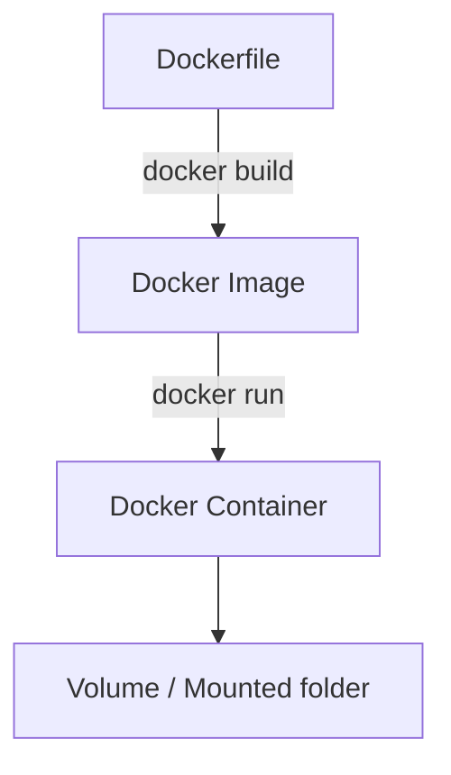

# Docker Hands-on Töötoa Materjal

## Eesmärk
Selles töötoas tutvume Dockeriga: mis see on, kuidas ta töötab, millised on põhimõisted ning kuidas ehitada ja käivitada oma konteinerid.  

Töötoa lõpuks oskad:
- Selgitada, mis on Docker, image, container, Dockerfile, volume ja network  
- Tõmmata Docker image’i Docker Hub-ist  
- Käivitada ja hallata konteinerit käsurealt  
- Luua oma `Dockerfile` ja sellest image  
- Kasutada volumes/mountingut andmete talletamiseks  

---

## Mis on Docker?
Docker on tööriist, mis võimaldab sul käitada rakendusi isoleeritud **konteinerites**.  

Miks see kasulik on?  
- **Platvormi sõltumatus** – rakendus töötab ühtemoodi igal masinal.  
- **Kergekaalulisus** – erinevalt virtuaalmasinast ei vaja täit OS-i, vaid ainult vajalikku rakendust ja sõltuvusi.  
- **Reprodutseeritavus** – sama image tagab sama keskkonna.  

Docker koosneb kahest peamisest komponendist:  
- **Docker Engine** (daemon) – taustal töötav teenus, mis haldab konteinerite käivitamist.  
- **Docker CLI / Desktop** – vahendid, mille kaudu kasutaja suhelda saab.  

---

## Põhimõisted

### Docker Image
- Retsept või **pakendatud mall**, mis sisaldab rakendust, teeke ja keskkonda.  
- Põhimõtteliselt nagu **programmi installipakett**, mida saab igal pool käivitada.  
- Näide: `python:3.11-slim` sisaldab Python 3.11 tõlgi ja minimaalse Linuxi baassüsteemi.  

### Docker Container
- **Jooksev protsess**, mis on loodud image’i baasil.  
- Container on eraldatud ülejäänud süsteemist (nagu “liivakast”).  
- Kui image on *retsept*, siis container on *valmis toit, mis on laual*.  

### Dockerfile
- Tekstifail, mis kirjeldab, kuidas image ehitatakse.  
- Sisaldab järjestikku käske nagu `FROM`, `COPY`, `RUN`, `CMD`.  
- Näide:  
  - `FROM python:3.11-slim` → aluseks Python  
  - `COPY app.py /app/app.py` → kopeeri fail image’i sisse  
  - `CMD ["python", "app.py"]` → käivita rakendus konteineris  

### Docker Volumes & Mounts
- **Volume** – Docker haldab andmete talletamise kausta ise.  
- **Bind mount** – seod kindla hosti kausta konteineriga (`-v /host/path:/container/path`).  
- Vajalik, kui tahad andmeid püsivalt alles hoida või neid jagada konteineri ja hosti vahel.  

### Docker Networks
- Konteinerid saavad omavahel suhelda läbi võrgu.  
- Vaikimisi pannakse nad “bridge” võrku.  
- Kasutatakse, kui tahad näiteks veebiserverit ja andmebaasi panna suhtlema konteinerite vahel.  

---

## Illustreeriv skeem



---

## Olulisemad käsud ja argumendid

### Versiooni kontroll
```bash
docker --version
```
Annab teada, kas Docker on õigesti paigaldatud.  

---

### Image tõmbamine
```bash
docker pull ubuntu
```
Laeb `ubuntu` image’i Docker Hub-ist alla. Kui käivitad `docker run ubuntu`, aga image puudub, tõmmatakse see automaatselt.  

---

### Containeri käivitamine
```bash
docker run ubuntu
```
Käivitatakse uus konteiner `ubuntu` image’i põhjal. Kuna käske pole antud, lõpetab ta kohe.  

---

### Tähtsad `docker run` argumendid

- **`-it`** – *interaktiivne terminal*  
  - `-i` = interactive → hoiab STDIN avatud, saad sisestada käske.  
  - `-t` = tty → annab “terminali” tunde (bash prompt).  
  - Koos tähendab: saad konteinerisse sisse ja töötada nagu oma arvutis.  
  - Näide:  
    ```bash
    docker run -it ubuntu bash
    ```
    Käivitab Ubuntu, avab käsurea sees.  

- **`-d`** – *detached mode*  
  - Käivitab konteineri taustal (ei seo terminali külge).  
  - Sobib teenustele (nt veebiserver).  
  - Näide:  
    ```bash
    docker run -d nginx
    ```
    Nginx veebiserver töötab taustal.  

- **`--name`** – anna konteinerile nimi.  
  - Lihtsam kui kasutada automaatset ID-d.  
  - Näide:  
    ```bash
    docker run -dit --name minu_ubuntu ubuntu bash
    ```

- **`-p host:container`** – portide avamine.  
  - Näide:  
    ```bash
    docker run -d -p 8080:80 nginx
    ```
    Avab brauseris http://localhost:8080 Nginxi serveri.  

- **`-v host:container`** – volumes / bind mounts.  
  - Näide:  
    ```bash
    docker run -it -v $(pwd)/data:/data ubuntu bash
    ```
    Seob hosti kausta `data` konteineri `/data` kaustaga.  

---

### Konteinerite haldamine

```bash
# Näita jooksvaid konteinerid
docker ps

# Näita kõiki konteinerid (sh peatatud)
docker ps -a

# Peata konteiner
docker stop <name_or_id>

# Käivita peatatud konteiner uuesti
docker start <name_or_id>

# Ava uuesti terminal sees
docker exec -it <name_or_id> bash

# Vaata logisid
docker logs <name_or_id>

# Kustuta konteiner
docker rm <name_or_id>
```

---

## Ülesanded

### Ülesanne 1: Hello World Dockeriga
Õpi oma esimest konteinerit käivitama.  

1. Käivita test-image:  
   ```bash
   docker run hello-world
   ```
   See tõmbab alla väikese programmi, mis prindib ekraanile tervituse ja kinnitab, et Docker töötab.  

2. Kontrolli, kas konteiner salvestati ajaloosse:  
   ```bash
   docker ps -a
   ```

---

### Ülesanne 2: Interaktiivne Ubuntu
1. Tõmba Ubuntu image:  
   ```bash
   docker pull ubuntu
   ```

2. Käivita interaktiivne terminal konteineris:  
   ```bash
   docker run -it ubuntu bash
   ```

3. Proovi sees Linuxi käske:  
   - `ls`, `pwd` (failide ja kaustade vaatamine)  
   - `apt-get update` (paketihaldus)  

4. Välju konteinerist: `exit`.  

---

### Ülesanne 3: Containeri life-cycle
Õpi konteinereid peatama ja taaskäivitama.  

1. Käivita taustal konteiner nimega `test-ctr`:  
   ```bash
   docker run -dit --name test-ctr ubuntu bash
   ```

2. Kontrolli olekut:  
   ```bash
   docker ps
   ```

3. Peata konteiner:  
   ```bash
   docker stop test-ctr
   ```

4. Käivita uuesti:  
   ```bash
   docker start test-ctr
   ```

5. Ava uuesti terminal sees:  
   ```bash
   docker exec -it test-ctr bash
   ```

---

### Ülesanne 4: Oma Dockerfile
Õpi ehitama oma image’i.  

1. Loo fail `Dockerfile`:  
   ```dockerfile
   FROM python:3.11-slim
   COPY app.py /app/app.py
   WORKDIR /app
   CMD ["python", "app.py"]
   ```

2. Loo fail `app.py`:  
   ```python
   print("Tere Dockerist!")
   ```

3. Ehita image:  
   ```bash
   docker build -t myapp .
   ```

4. Käivita image:  
   ```bash
   docker run myapp
   ```

---

### Ülesanne 5: Volumes & Mounts
Õpi, kuidas andmeid jagada konteineri ja hosti vahel.  

1. Loo kaust `data` ja sinna fail `hello.txt`.  
2. Käivita konteiner, kus kaust mountitakse:  
   ```bash
   docker run -it -v $(pwd)/data:/data ubuntu bash
   ```

3. Konteineris tee:  
   ```bash
   cat /data/hello.txt
   ```

4. Lisa sinna uus fail ja kontrolli, et see ilmub ka hosti kausta.  

---

## Docker Hub ja registrid
- [Docker Hub](https://hub.docker.com/) on avalik registry.  
- Sealt saab alla laadida valmis imagesid (`docker pull`).  
- Sinna saab üles laadida ka enda tehtud imagesid (`docker push`).  
- Näide:  
  ```bash
  docker pull nginx
  docker tag myapp myuser/myapp:1.0
  docker push myuser/myapp:1.0
  ```

---

## Edasi lugemiseks
- [Docker Documentation](https://docs.docker.com/)  
- [Play with Docker (online playground)](https://labs.play-with-docker.com/)  
