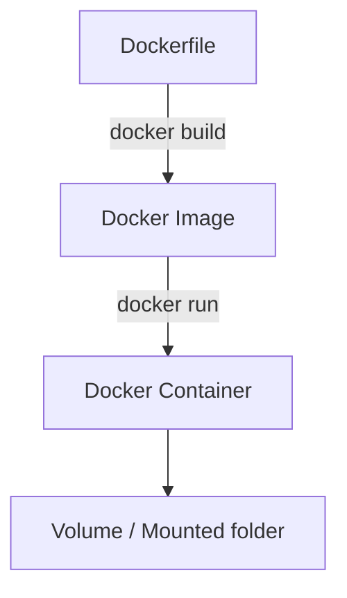

# Docker Hands-on Töötoa Materjal

## Eesmärk
Selles töötoas tutvume Dockeriga: mis see on, kuidas ta töötab, millised on põhimõisted ning kuidas ehitada ja käivitada oma konteinerid.  

Töötoa lõpuks oskad:
- Tõmmata Docker image’i Docker Hub-ist  
- Käivitada ja hallata konteinerit  
- Luua oma `Dockerfile` ja sellest image  
- Kasutada volumes/mountingut andmete talletamiseks  

---

## Mis on Docker?
Docker on tööriist, mis võimaldab sul käitada rakendusi isoleeritud **konteinerites**.  

- **Docker Desktop** – graafiline keskkond (Windows/Mac)  
- **Docker CLI (Command Line Interface)** – käsurida konteinerite ja imagete haldamiseks  

---

## Põhimõisted

### Docker Image
- Retsept / snapshot, mis sisaldab rakendust ja selle sõltuvusi  
- Näide: `python:3.11-slim`  

### Docker Container
- Jooksev protsess, mis põhineb image’il  
- Võib vaadata kui “käivitatud image”  

### Dockerfile
- Fail, mis kirjeldab kuidas image ehitada  
- Sisaldab käske nagu `FROM`, `COPY`, `RUN`, `CMD`  

### Docker Volumes & Mounts
- Võimaldavad andmeid hoida ka pärast konteineri sulgemist  
- Võimaldavad jagada andmeid hosti ja konteineri vahel  

---

## Illustreeriv skeem



---

## Olulisemad käsud

```bash
# Versiooni kontroll
docker --version

# Image tõmbamine
docker pull <image>

# Containeri käivitamine
docker run <image>

# Interaktiivne container
docker run -it ubuntu bash

# Jooksva konteineri nimekiri
docker ps

# Kõigi konteinerite nimekiri (sh peatatud)
docker ps -a

# Containeri peatamine ja kustutamine
docker stop <id>
docker rm <id>

# Logide vaatamine
docker logs <id>

# Exec konteinerisse
docker exec -it <id> bash
```

---

## Ülesanded

### Ülesanne 1: Hello World Dockeriga
1. Tõmba ja käivita test-image:  
   ```bash
   docker run hello-world
   ```

2. Kontrolli, kas container ilmus nimekirja:  
   ```bash
   docker ps -a
   ```

---

### Ülesanne 2: Interaktiivne Ubuntu
1. Tõmba Ubuntu image:  
   ```bash
   docker pull ubuntu
   ```

2. Käivita interaktiivne terminal konteineris:  
   ```bash
   docker run -it ubuntu bash
   ```

3. Proovi sees `ls`, `pwd`, `apt-get update`.  
4. Välju konteinerist `exit`.  

---

### Ülesanne 3: Containeri life-cycle
1. Käivita konteiner:  
   ```bash
   docker run -dit --name test-ctr ubuntu bash
   ```

2. Kontrolli konteineri olekut:  
   ```bash
   docker ps
   ```

3. Peata konteiner:  
   ```bash
   docker stop test-ctr
   ```

4. Käivita uuesti:  
   ```bash
   docker start test-ctr
   ```

---

### Ülesanne 4: Oma Dockerfile
1. Loo fail `Dockerfile` järgmise sisuga:  
   ```dockerfile
   FROM python:3.11-slim
   COPY app.py /app/app.py
   WORKDIR /app
   CMD ["python", "app.py"]
   ```

2. Loo fail `app.py`:  
   ```python
   print("Tere Dockerist!")
   ```

3. Ehita image:  
   ```bash
   docker build -t myapp .
   ```

4. Käivita image:  
   ```bash
   docker run myapp
   ```

---

### Ülesanne 5: Volumes & Mounts
1. Loo kaust `data` ja sinna fail `hello.txt`.  
2. Käivita konteiner, kus see kaust mountitakse:  
   ```bash
   docker run -it -v $(pwd)/data:/data ubuntu bash
   ```

3. Konteineris tee:  
   ```bash
   cat /data/hello.txt
   ```

4. Kirjuta midagi uude faili konteineris ja vaata, et see ilmub ka hostis.  

---

## Docker Hub ja registrid
- [Docker Hub](https://hub.docker.com/) on avalik registry  
- Võimaldab tõmmata valmis imagesid või pushida enda omi  
- Näited: `docker pull nginx`, `docker push myuser/myimage`  

---

## Edasi lugemiseks
- [Docker Documentation](https://docs.docker.com/)  
- [Play with Docker (online playground)](https://labs.play-with-docker.com/)  
