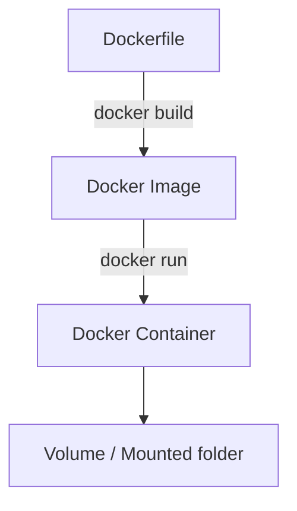

# Docker Hands-on Töötoa Materjal

## Eesmärk
Selles töötoas tutvume Dockeriga: mis see on, kuidas ta töötab, millised on põhimõisted ning kuidas ehitada ja käivitada oma konteinerid.  

Töötoa lõpuks oskad:
- Selgitada, mis on Docker, image, container, Dockerfile, volume ja network  
- Tõmmata Docker image’i Docker Hub-ist  
- Käivitada ja hallata konteinerit käsurealt  
- Luua oma `Dockerfile` ja sellest image  
- Kasutada volumes/mountingut andmete talletamiseks  

---

## Mis on Docker?
Docker on tööriist, mis võimaldab sul käitada rakendusi isoleeritud **konteinerites**.  

Miks see kasulik on?  
- **Platvormi sõltumatus** – rakendus töötab ühtemoodi igal masinal.  
- **Kergekaalulisus** – erinevalt virtuaalmasinast ei vaja täit OS-i, vaid ainult vajalikku rakendust ja sõltuvusi.  
- **Reprodutseeritavus** – sama image tagab sama keskkonna.  

Docker koosneb kahest peamisest komponendist:  
- **Docker Engine** (daemon) – taustal töötav teenus, mis haldab konteinerite käivitamist.  
- **Docker CLI / Desktop** – vahendid, mille kaudu kasutaja suhelda saab.  

---

## Põhimõisted

### Docker Image
- Retsept või **pakendatud mall**, mis sisaldab rakendust, teeke ja keskkonda.  
- Põhimõtteliselt nagu **programmi installipakett**, mida saab igal pool käivitada.  
- Näide: `python:3.11-slim` sisaldab Python 3.11 tõlgi ja minimaalse Linuxi baassüsteemi.  

### Docker Container
- **Jooksev protsess**, mis on loodud image’i baasil.  
- Container on eraldatud ülejäänud süsteemist (nagu “liivakast”).  
- Kui image on *retsept*, siis container on *valmis toit, mis on laual*.  

### Dockerfile
- Tekstifail, mis kirjeldab, kuidas image ehitatakse.  
- Sisaldab järjestikku käske nagu `FROM`, `COPY`, `RUN`, `CMD`.  
- Näide:  
  - `FROM python:3.11-slim` → aluseks Python  
  - `COPY app.py /app/app.py` → kopeeri oma programmi scripti fail image’i sisse  
  - `CMD ["python", "app.py"]` → käivita rakendus konteineris  

### Docker Volumes & Mounts
- **Volume** – Docker haldab andmete talletamise kausta ise.  
- **Bind mount** – seod kindla hosti kausta konteineriga (`-v /host/path:/container/path`).  
- Vajalik, kui tahad andmeid püsivalt alles hoida või neid jagada konteineri ja hosti vahel.  

### Docker Networks
- Konteinerid saavad omavahel suhelda läbi võrgu.  
- Vaikimisi pannakse nad “bridge” võrku.  
- Kasutatakse, kui tahad näiteks veebiserverit ja andmebaasi panna suhtlema konteinerite vahel.  

---

## Illustreeriv skeem



---

## Olulisemad käsud ja argumendid

### Versiooni kontroll
```bash
docker --version
```
Annab teada, kas Docker on õigesti paigaldatud.  

---

### Image tõmbamine
```bash
docker pull ubuntu
```
Laeb `ubuntu` image’i Docker Hub-ist alla. Kui käivitad `docker run ubuntu`, aga image puudub, tõmmatakse see automaatselt.  

---

### Containeri käivitamine
```bash
docker run ubuntu
```
Käivitatakse uus konteiner `ubuntu` image’i põhjal. Kuna käske pole antud, lõpetab ta kohe.

**Oluline teada konteinerite käivitamisel:**
- Iga `docker run` käsk loob alati *uue* konteineri, isegi kui kasutad sama image'it.
- Kui kasutad `--name` argumenti (nt `--name minu_ubuntu`), peab nimi olema unikaalne. Kui sama nimega konteiner juba eksisteerib (ka siis, kui ta on peatatud), annab Docker vea.
- Kui midagi läks käivitamisel valesti (nt vale käsk, port juba kasutusel vms), siis:
  - Kontrolli olemasolevaid konteinereid käsuga `docker ps -a`.
  - Vajadusel peata (`docker stop <name>`) ja kustuta (`docker rm <name>`) eelmine konteiner enne uue loomist sama nime või samade portidega.
- Kui `--name` argumenti ei kasuta, loob Docker automaatselt uue anonüümse nimega konteineri. See võib põhjustada portide konflikte, kui mitu konteinerit üritavad kasutada sama porti.
- Kui soovid sama konteinerit uuesti kasutada, kasuta `docker start <name>` või `docker restart <name>`, mitte `docker run`.


---

### Tähtsad `docker run` argumendid

**Süntaks (SYNOPSIS):**
```text
docker run [OPTIONS] IMAGE [COMMAND] [ARG...]
```
Näide koos levinumate argumentidega:
```text
docker run -d --name minu_nginx -p 8080:80 -v $(pwd)/data:/usr/share/nginx/html nginx
```
See käivitab taustal (`-d`) nimega `minu_nginx` konteineri, seob pordi 8080 hostil pordiga 80 konteineris, mountib kohaliku kausta `data` Nginxi veebikausta ning kasutab `nginx` image'it.

- **`-it`** – *interaktiivne terminal*  
  - `-i` = interactive → hoiab STDIN avatud, saad sisestada käske.  
  - `-t` = tty → annab “terminali” tunde (bash prompt).  
  - Koos tähendab: saad konteinerisse sisse ja töötada nagu oma arvutis.  
  - Näide:  
    ```bash
    docker run -it ubuntu bash
    ```
    Käivitab Ubuntu, avab käsurea sees.  

- **`-d`** – *detached mode*  
  - Käivitab konteineri taustal (ei seo terminali külge).  
  - Sobib teenustele (nt veebiserver).  
  - Näide:  
    ```bash
    docker run -d nginx
    ```
    Nginx veebiserver töötab taustal.  

- **`--name`** – anna konteinerile nimi.  
  - Lihtsam kui kasutada automaatset ID-d.  
  - Näide:  
    ```bash
    docker run -it --name minu_ubuntu ubuntu bash
    ```

- **`-p host:container`** – portide avamine.  
  - Näide:  
    ```bash
    docker run -d -p 8080:80 nginx
    ```
    Avab brauseris http://localhost:8080 Nginxi serveri.  

  **Soovitused hosti portide valimiseks:**
  - Hostipoolne port (`host:container`) võib olla suvaline vaba port, kuid vältida tuleks süsteemi- ja standardporte (0–1023).
  - Hea tava on kasutada vahemikku **1024–49151** (nn. "registered ports") või veelgi turvalisemalt **20000–49151**. (Lisaks plokivad brauserid osad pordid, vaata näiteks [Chrome'i blokeeritud porte](https://chromium.googlesource.com/chromium/src/+/refs/heads/main/net/base/port_util.cc).)
  - Kui jooksutad mitut konteinerit, vali igale erinev hosti port (nt 8080, 8081, 8888 jne).
  - Väldi avalike teenuste puhul tüüpilisi porte (nt 80, 443), kui pole kindel, et neid pole juba kasutuses.
  - Kontrolli, kas port on vaba käsuga `lsof -i :PORT` või `netstat -tuln | grep PORT`.
  - Vajadusel saad kasutada ka suvalist vaba porti, määrates ainult konteineri poole (`-p :80`), kuid siis määrab Docker hosti porti automaatselt.

  **Näide turvalisest portide määramisest:**
  ```bash
  docker run -d -p 18080:80 nginx
  ```
  See seob hosti pordi 18080 konteineri pordiga 80.

- **`-v host:container`** – volumes / bind mounts.  
  - Näide:  
    ```bash
    docker run -it -v $(pwd)/data:/data ubuntu bash
    ```
    Seob hosti kausta `data` konteineri `/data` kaustaga.  

---

### Konteinerite haldamine

```bash
# Näita jooksvaid konteinerid
docker ps

# Näita kõiki konteinerid (sh peatatud)
docker ps -a

# Peata konteiner
docker stop <name_or_id>

# Käivita peatatud konteiner uuesti
docker start <name_or_id>

# Ava uuesti terminal sees
docker exec -it <name_or_id> bash

# Vaata logisid
docker logs <name_or_id>

# Kustuta konteiner
docker rm <name_or_id>
```

**Konteineri elutsükkel:**
- Kui käivitad konteineri (`docker run`), luuakse uus konteiner ja see hakkab tööle.
- Kui konteineri protsess lõppeb või kasutad `docker stop`, siis konteiner *peatatakse* (ta jääb süsteemi alles, kuid ei tööta).
- Peatatud konteinerit saab uuesti käivitada käsuga `docker start <name_or_id>`. See jätkab samast kohast, kus pooleli jäi (failid ja muud andmed konteineri sees on alles).
- Kui konteinerit enam ei vaja, saab selle süsteemist eemaldada käsuga `docker rm <name_or_id>`. See kustutab konteineri metaandmed ja failisüsteemi (kui andmed pole salvestatud volume'i või bind mounti).
- NB! `docker stop` *ei eemalda* konteinerit, vaid ainult peatab selle. Süsteemi jäävad ka peatatud konteinerid, kuni need käsitsi eemaldad.
- Kui proovid luua uue konteineri sama nimega, aga vana on alles (ka peatatud kujul), annab Docker vea.

**Lühidalt:**  
- `docker run` – loob ja käivitab uue konteineri.
- `docker stop` – peatab konteineri, kuid ei eemalda seda.
- `docker start` – käivitab peatatud konteineri uuesti.
- `docker rm` – eemaldab konteineri süsteemist lõplikult.
- Kasuta `docker ps -a`, et näha ka peatatud konteinereid ja vajadusel need eemaldada.

---

### Kuidas hallata konteinerite tekitatud volume

**Mis on konteineri volume?**  
Kui käivitad konteineri ja kasutad `-v` või `--mount` argumenti, võib Docker luua automaatselt uue volume (kui pole määratud olemasolevat). Mõned images (nt andmebaasid) võivad Dockerfile'is määrata `VOLUME` käsu, mis paneb Dockeri vaikimisi looma anonüümse volume, kui sa ise midagi ei määra.

**Kuidas määrab süntaks, millist tüüpi volume kasutatakse?**  
- Kui kasutad `-v <host_path>:<container_path>` või `--mount type=bind,source=<host_path>,target=<container_path>`, siis *mountitakse hosti kaust* konteinerisse (bind mount).  
  - Näide:  
    ```bash
    docker run -v $(pwd)/data:/data ubuntu
    ```
  - Sellisel juhul andmed salvestatakse otse hosti failisüsteemi ning neid *ei näe* `docker volume ls` käsuga.
- Kui kasutad `-v <volume_name>:<container_path>` või `--mount type=volume,source=<volume_name>,target=<container_path>`, siis kasutatakse *Docker volume'it* (nimeline või anonüümne).  
  - Näide:  
    ```bash
    docker run -v mydata:/data ubuntu
    ```
  - Selline volume on nähtav käsuga `docker volume ls` ja Docker haldab selle asukohta ise.
- Kui kasutad ainult konteineri path'i (`-v /data` või Dockerfile's `VOLUME /data`), loob Docker *anonüümse volume*.

**Lühidalt:**  
- *Bind mount* (`/host/path:/container/path`): andmed hosti failisüsteemis, ei näe `docker volume ls` all.
- *Docker volume* (`volume_name:/container/path`): Docker haldab, näha `docker volume ls` all.
- *Anonüümne volume* (`/container/path`): Docker loob automaatselt, näha `docker volume ls` all.

**Kuidas neid uuesti kasutatakse?**  
- Anonüümseid volume'eid ei saa taaskasutada, iga kord luuakse uus.
- Nimelisi volume'eid saab taaskasutada erinevate konteinerite vahel, kui sama nime kasutad.
- Volume'id säilitavad andmed ka siis, kui konteiner kustutatakse.

**Volume'ite vaatamine ja haldamine:**
```bash
# Näita kõiki volume
docker volume ls

# Vaata konkreetse volume'i infot
docker volume inspect <volume_name>

# Kustuta volume (NB! ainult kui seda ei kasuta ükski konteiner)
docker volume rm <volume_name>

# Kustuta kõik kasutamata volume'id
docker volume prune
```

**Kuidas aru saada, et konteiner loob volume?**
- Vaata image'i Dockerfile'i – kui seal on `VOLUME` käsk, loob Docker selle mount-punkti jaoks volume.
- Kui käivitad konteineri ilma `-v` või `--mount` argumendita, aga image kasutab `VOLUME`, tekib anonüümne volume.
- Kontrolli konteineri detaile:
  ```bash
  docker inspect <container_id>
  ```
  Otsi väljalt `Mounts`, kas seal on tüüp `volume`.

**Kokkuvõte:**  
- Volume'id on mõeldud andmete püsivaks salvestamiseks.
- Anonüümseid volume'eid võib koguneda, kui neid ei hallata – kasuta `docker volume ls` ja `docker volume prune`.
- Nimelisi volume'eid saad taaskasutada erinevate konteinerite vahel.

---

## Ülesanded

### Ülesanne 1: Hello World Dockeriga
Õpi oma esimest konteinerit käivitama.  

1. Käivita test-image:  
   ```bash
   docker run hello-world
   ```
   See tõmbab alla väikese programmi, mis prindib ekraanile tervituse ja kinnitab, et Docker töötab.  

2. Kontrolli, kas konteiner salvestati ajaloosse:  
   ```bash
   docker ps -a
   ```

---

### Ülesanne 2: Interaktiivne Ubuntu
1. Tõmba Ubuntu image:  
   ```bash
   docker pull ubuntu
   ```

2. Käivita interaktiivne terminal konteineris:  
   ```bash
   docker run -it ubuntu bash
   ```

3. Proovi sees Linuxi käske:  
   - `ls`, `pwd` (failide ja kaustade vaatamine)  
   - `apt-get update` (paketihaldus)  

4. Välju konteinerist: `exit`.  

---

### Ülesanne 3: Containeri life-cycle
Õpi konteinereid peatama ja taaskäivitama.  

1. Käivita taustal konteiner nimega `test-ctr`:  
   ```bash
   docker run -dit --name test-ctr ubuntu bash
   ```

2. Kontrolli olekut:  
   ```bash
   docker ps
   ```

3. Peata konteiner:  
   ```bash
   docker stop test-ctr
   ```

4. Käivita uuesti:  
   ```bash
   docker start test-ctr
   ```

5. Ava uuesti terminal sees:  
   ```bash
   docker exec -it test-ctr bash
   ```

---

### Ülesanne 4: Oma Dockerfile
Õpi ehitama oma image’i.  

1. Loo fail `Dockerfile`:  
   ```dockerfile
   FROM python:3.11-slim
   COPY app.py /app/app.py
   WORKDIR /app
   CMD ["python", "app.py"]
   ```

2. Loo fail `app.py`:  
   ```python
   print("Tere Dockerist!")
   ```

3. Ehita image:  
   ```bash
   docker build -t myapp .
   ```

4. Käivita image:  
   ```bash
   docker run myapp
   ```

---

### Ülesanne 5: Volumes & Mounts
Õpi, kuidas andmeid jagada konteineri ja hosti vahel.  

1. Loo kaust `data` ja sinna fail `hello.txt`.  
2. Käivita konteiner, kus kaust mountitakse:  
   ```bash
   docker run -it -v $(pwd)/data:/data ubuntu bash
   ```

3. Konteineris tee:  
   ```bash
   cat /data/hello.txt
   ```

4. Lisa sinna uus fail ja kontrolli, et see ilmub ka hosti kausta.  

---

## Docker Hub ja registrid
- [Docker Hub](https://hub.docker.com/) on avalik registry.  
- Sealt saab alla laadida valmis imagesid (`docker pull`).  
- Sinna saab üles laadida ka enda tehtud imagesid (`docker push`).  
- Näide:  
  ```bash
  docker pull nginx
  docker tag myapp myuser/myapp:1.0
  docker push myuser/myapp:1.0
  ```

---

## Edasi lugemiseks
- [Docker Documentation](https://docs.docker.com/)  
- [Play with Docker (online playground)](https://labs.play-with-docker.com/)
