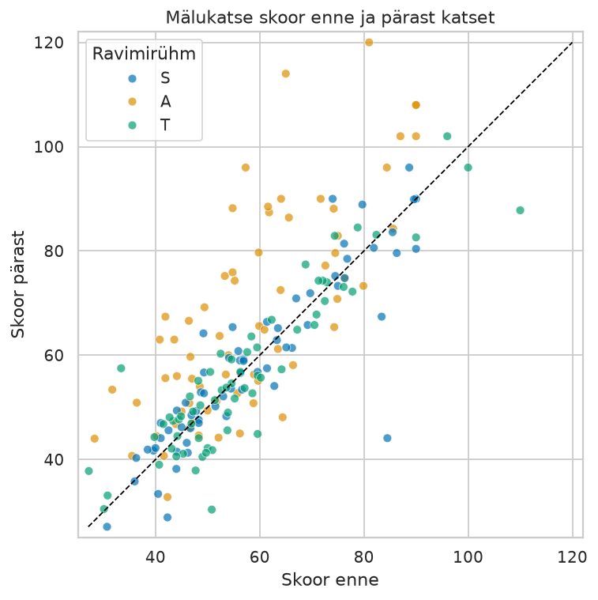
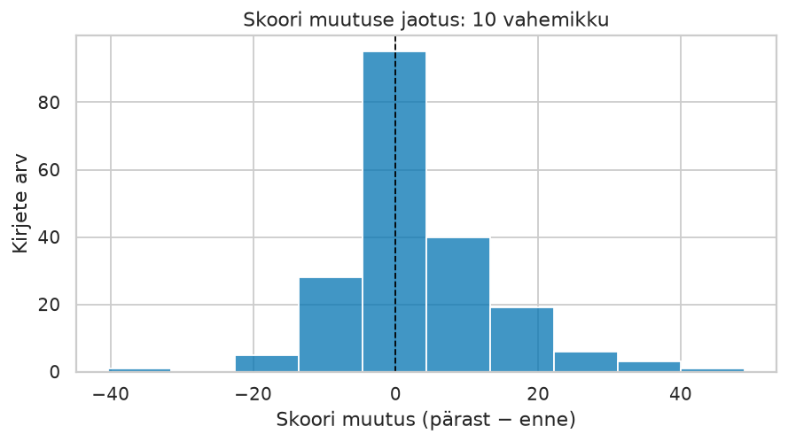
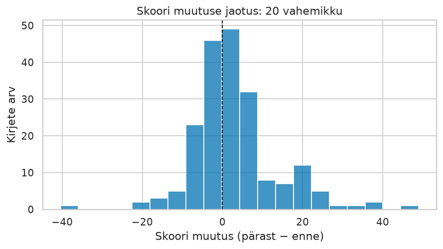
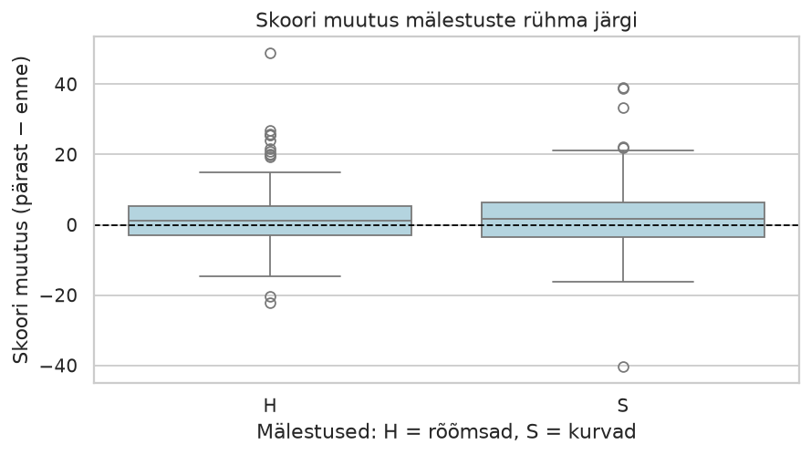
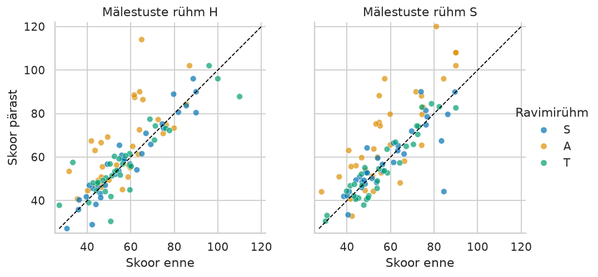

# Seaborni lahenduskäigud

Proovi esmalt [Seaborni vihiku](../Seaborn.ipynb) harjutusi. Käivita allolev ettevalmistus oma töövihikus üks kord. Seejärel saad iga ülesande koodiploki eraldi käivitada. Näidisjoonised on lisatud tulemuse võrdlemiseks; täpselt samasugune kujundus ei ole nõutud.

## Ettevalmistus

Tööta repo juurkaustas või kaustas `teemad/python`. Kohaliku faili puudumisel loetakse sama andmestik kursuse veebiallikast.

```python
# Teekide ja vajalike nimede importimine.
from pathlib import Path
import pandas as pd
import matplotlib.pyplot as plt
import seaborn as sns
from IPython.display import display

# Kohaliku faili otsimine ja vajaduse korral veebiallika valimine.
andmefail = Path("data/Islander_data.csv")
if not andmefail.is_file():
    andmefail = Path("../../data/Islander_data.csv")
if andmefail.is_file():
    allikas = andmefail
else:
    allikas = "https://raw.githubusercontent.com/adlerpriit/2025_taka_fall/37b50eb8474faeeb0993c2d4883680bee0560cbd/data/Islander_data.csv"
print("Andmete allikas:", allikas)

# CSV lugemine Pandase tabeliks.
algandmed = pd.read_csv(allikas)

# Graafikute ühise kujunduse määramine.
sns.set_theme(style="whitegrid", palette="colorblind")

# Kausta loomine piltide salvestamiseks.
kaust = Path("valjund")
kaust.mkdir(exist_ok=True)
```

## S-01

Üks punkt tähistab ühe lähterea enne- ja pärastmõõtmist. Värv eristab ravimirühma. Kõigepealt koosta punktdiagramm. Lisatud võrdsusjoon aitab eristada skoori suurenemist ja vähenemist: joonest kõrgemal on pärast-skoor suurem.

Piiride leidmiseks kasuta mõlema skooriveeru väikseimat ja suurimat väärtust. Võrdne telgede skaala muudab diagonaali tõlgendamise lihtsamaks.

```python
# Punktdiagramm: ravimirühmade eristamine värviga.
fig, ax = plt.subplots(figsize=(6, 6))
sns.scatterplot(
    data=algandmed, x="Mem_Score_Before", y="Mem_Score_After",
    hue="Drug", hue_order=["S", "A", "T"], alpha=0.7, ax=ax,
)

# Mõlema skooriveeru põhjal ühiste teljepiiride leidmine.
skoorid = algandmed[["Mem_Score_Before", "Mem_Score_After"]]
alumine = skoorid.min().min()
ylemine = skoorid.max().max()

# Võrdsusjoone lisamine: skoor pärast = skoor enne.
ax.plot([alumine, ylemine], [alumine, ylemine], color="black", linestyle="--", linewidth=1)

# Pealkirja, teljenimetuste ja teljepiiride määramine.
ax.set(
    title="Mälukatse skoor enne ja pärast katset",
    xlabel="Skoor enne", ylabel="Skoor pärast",
    xlim=(alumine - 2, ylemine + 2), ylim=(alumine - 2, ylemine + 2),
)

# Telgede ühine skaala ja legendi pealkiri.
ax.set_aspect("equal", adjustable="box")
ax.legend(title="Ravimirühm")
fig.tight_layout()

# Valmis joonise salvestamine.
fig.savefig(kaust / "s01_punktdiagramm.png", dpi=130, bbox_inches="tight")
plt.show()
```



**Kontroll:** teljed on õiges järjekorras, legendis on kolm rühma ja võrdlusjoon tähistab `pärast = enne`. Punktide kattumise tõttu ei pruugi iga kirje eraldi näha olla. Joonest kõrgemal paiknemine näitab skoori suurenemist, mitte iseenesest mälu paranemist.

## S-02

Kasuta sama tunnust ja muuda ainult vahemike arvu. Nullist vasakul on skoor vähenenud, paremal suurenenud. Tsükkel loob kaks eraldi joonist.

```python
# Tsükkel: kaks histogrammi eri arvu vahemikega.
for vahemikke in [10, 20]:
    fig, ax = plt.subplots(figsize=(7, 4))
    # Histogrammi koostamine praeguse vahemike arvuga.
    sns.histplot(data=algandmed, x="Diff", bins=vahemikke, ax=ax)
    # Nulljoone, pealkirja ja teljenimetuste lisamine.
    ax.axvline(0, color="black", linestyle="--", linewidth=1)
    ax.set(
        title=f"Skoori muutuse jaotus: {vahemikke} vahemikku",
        xlabel="Skoori muutus (pärast − enne)", ylabel="Kirjete arv",
    )
    fig.tight_layout()
    # Iga joonise salvestamine eraldi faili.
    fig.savefig(kaust / f"s02_histogramm_{vahemikke}.png", dpi=130, bbox_inches="tight")
    plt.show()
```





Mõlemas variandis koondub suur osa väärtusi nulli ümbrusse ning positiivne saba ulatub negatiivsest kaugemale. Rohkem vahemikke näitab peenemaid erinevusi ja teeb üksikud tulbad madalamaks. Algandmed ei muutu: muutub vaid see, kuidas väärtused vahemikesse koondatakse.

**Kontroll:** tulpade kõrguste summa on 198, sest selles failis `Diff`-väärtusi ei puudu. Y-telg näitab kirjete arvu, mitte skoori keskmist ega protsenti.

## S-03

Ravimirühma `A` mediaan on suurim ja ka kvartiilivahemik kõige laiem. Joonise lugemist saad kontrollida arvudega. Allolev lisakontroll arvutab 25. ja 75. protsentiili ning nende vahe.

```python
# Ravimirühmade mediaanide leidmine.
mediaanid = algandmed.groupby("Drug")["Diff"].median()

# Kvartiilide leidmine ja kvartiilivahe arvutamine.
kvartiilid = algandmed.groupby("Drug")["Diff"].quantile([0.25, 0.75]).unstack()
kvartiilivahe = kvartiilid[0.75] - kvartiilid[0.25]

# Mõlema kokkuvõtte kuvamine ühes tabelis.
display(pd.DataFrame({"mediaan": mediaanid, "kvartiilivahe": kvartiilivahe}).round(2))
```

| Rühm | Mediaan | Kvartiilivahe |
| --- | ---: | ---: |
| A | 7,9 | 20,0 |
| S | 0,3 | 6,2 |
| T | 0,2 | 8,2 |

Ainult keskmiste näitamine peidaks jaotuse laiuse, mediaani asukoha ja äärmuslikumad vaatlused. Kastdiagrammist üksi ei saa teha põhjuslikku järeldust: vaja on arvestada katse korraldust ja muid rühmade erinevusi. Kvartiilide arvutamise lisavõtted ei ole põhiosa ülesande lahendamise eelduseks.

## S-04 — lõpuülesande näide

Näidisküsimus: **kuidas erineb skoori muutuse jaotus rõõmsate ja kurbade mälestuste rühmas?** Ravimirühmade küsimuse korral on töövoog sarnane, kuid rühmitamistunnus on `Drug`.

Alusta koopiast ja kontrolli vajalikke andmeid. Arvuta muutus uuesti; võrdluses kasuta väikest tolerantsi, sest kümnendarvude lahutamine ei pruugi olla täpselt esitatav. Siin ei puudu vajalikud väärtused, seega ridu eemaldada ei ole vaja.

```python
# Töökoopia loomine ja puuduvate väärtuste kontrollimine.
analyys = algandmed.copy()
print("Ridu ja veerge:", analyys.shape)
display(analyys[["Happy_Sad_group", "Mem_Score_Before", "Mem_Score_After", "Diff"]].isna().sum())

# Skoori muutuse arvutamine ja võrdlemine olemasoleva veeruga.
analyys["muutus"] = analyys["Mem_Score_After"] - analyys["Mem_Score_Before"]
assert (analyys["muutus"] - analyys["Diff"]).abs().max() < 1e-9

# Rühmade keskmiste ja suuruste arvutamine.
kokkuvote = analyys.groupby("Happy_Sad_group").agg(
    keskmine_muutus=("muutus", "mean"),
    ridu=("muutus", "size"),
).reset_index()
display(kokkuvote.round(2))
assert kokkuvote["ridu"].sum() == len(analyys)

# Rühmade jaotuste võrdlemine kastdiagrammil.
fig, ax = plt.subplots(figsize=(7, 4))
sns.boxplot(
    data=analyys, x="Happy_Sad_group", y="muutus",
    order=["H", "S"], color="lightblue", ax=ax,
)

# Võrdlusjoone, pealkirja ja teljenimetuste lisamine.
ax.axhline(0, color="black", linestyle="--", linewidth=1)
ax.set(
    title="Skoori muutus mälestuste rühma järgi",
    xlabel="Mälestused: H = rõõmsad, S = kurvad",
    ylabel="Skoori muutus (pärast − enne)",
)
fig.tight_layout()

# Kokkuvõttetabeli ja joonise salvestamine.
esitus = Path("esitus")
esitus.mkdir(exist_ok=True)
kokkuvote.to_csv(esitus / "kokkuvote.csv", index=False)
fig.savefig(esitus / "graafik.png", dpi=130, bbox_inches="tight")
print("Tulemuste kaust:", esitus.resolve())
plt.show()
```



Näidistõlgendus: „Võrdlesin skoori muutust rõõmsate ja kurbade mälestuste rühmas. Mõlemas on 99 kirjet; keskmine muutus on vastavalt 2,73 ja 3,18. Kastdiagrammis kattuvad rühmade jaotused ulatuslikult. Nende tulemuste põhjal üksi ei saa väita, et mälestuste liik põhjustab skoori erinevuse.”

**Kontroll:** arvutus ja graafik kasutavad sama töökoopiat. CSV-s on kaks rida ja kolm veergu; sinna ei lisandu tehnilist reaindeksit. Pilt ja tabel salvestatakse kausta `esitus`, mitte näidete ajutisse väljundikausta. Lisa failid oma reposse ning taaskäivita enne töö lõpetamist kernel.

## S-L01 — lisamaterjal

`col` jagab vaatlused paneelidesse ning `hue` värvib punktid ravimirühma järgi. Telgede ühesugune skaala aitab rühmi võrrelda. `relplot()` loob ise joonise, mistõttu ei kasutata siin `plt.subplots()` ega `ax=` argumenti.

```python
# Mõlemale teljele ühiste piiride leidmine.
skoorid = algandmed[["Mem_Score_Before", "Mem_Score_After"]]
alumine = skoorid.min().min()
ylemine = skoorid.max().max()

# relplot(): mälestuste rühmad eri paneelides, ravimirühmad eri värvidega.
g = sns.relplot(
    data=algandmed, x="Mem_Score_Before", y="Mem_Score_After",
    col="Happy_Sad_group", col_order=["H", "S"],
    hue="Drug", hue_order=["S", "A", "T"], kind="scatter",
    height=4, aspect=1, alpha=0.7,
)

# Võrdsusjoone ja sama skaala lisamine kõigile paneelidele.
for ax in g.axes.flat:
    ax.plot([alumine, ylemine], [alumine, ylemine], color="black", linestyle="--", linewidth=1)
    ax.set(xlim=(alumine - 2, ylemine + 2), ylim=(alumine - 2, ylemine + 2))
    ax.set_aspect("equal", adjustable="box")

# Teljenimetuste, paneelide pealkirjade ja legendi määramine.
g.set_axis_labels("Skoor enne", "Skoor pärast")
g.set_titles("Mälestuste rühm {col_name}")
g.legend.set_title("Ravimirühm")

# Paneelidega joonise salvestamine.
g.savefig(kaust / "sl1_paneelid.png", dpi=130, bbox_inches="tight")
plt.show()
```



Paneelid võimaldavad võrrelda enne- ja pärastmõõtmiste seost eraldi mälestuste rühmades, säilitades kummaski ravimirühmade eristuse. Tähised `H` ja `S` tähendavad siin rõõmsaid ja kurbi mälestusi; legendi ravimikood `S` tähendab platseebot.
